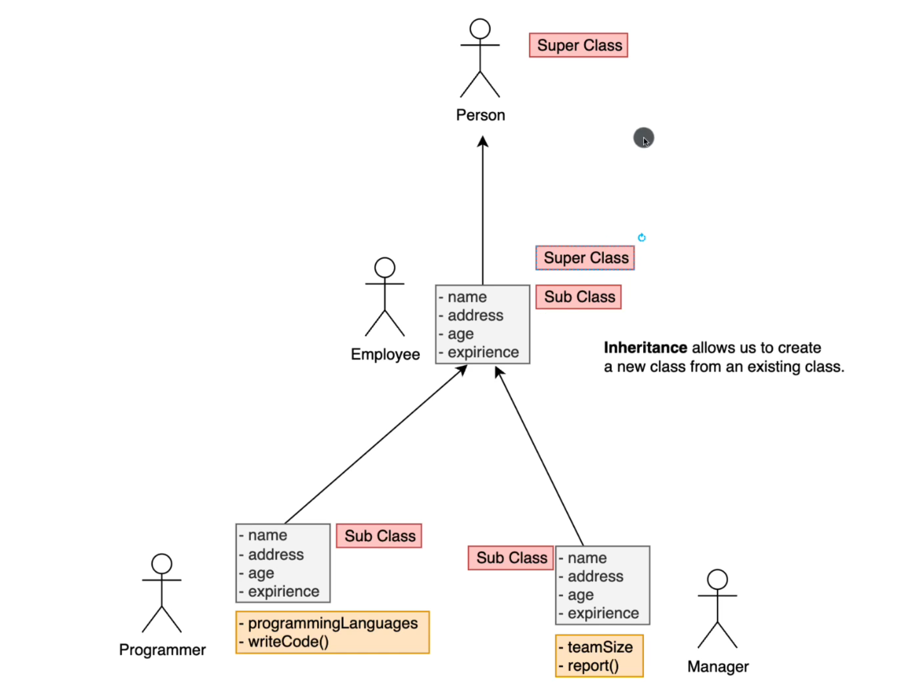
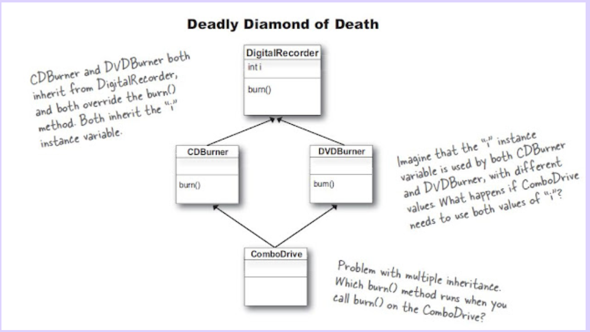

### Overriding equals method for comparing 2 objects' internal state

* Inside the cat class :-

```
// This can be generated using the IDE 🥹
    @Override
    public boolean equals(Object o) {
        // this --> current obj ,  o --> object which is being compared
        if (this == o) return true;  // If the two references point to the same object, they are equal

        if (o == null || getClass() != o.getClass())
            return false;  // If the other object is null or not an instance of the Cat class, they are not equal

        Cat cat = (Cat) o;  // Cast the other object to a Cat instance

        // Compare the values of the instance variables
        // for comparing primitives == is used & for comparing strings equals method is used 😊
        return age == cat.age && Objects.equals(name, cat.name) && Objects.equals(color, cat.color);
    }

    @Override
    public int hashCode() {
        return Objects.hash(name, age, color);
    }

```

* The equals method in Java is used to determine if two objects are considered equal or not. In the Java programming
  language, the equals method is defined in the Object class, which is the root class for all classes in Java. By
  default, the equals method provided by the Object class compares the references (memory addresses) of the two objects.
  However, in many cases, we want to consider two objects as equal based on their internal state (the values of their
  instance variables) rather than their memory addresses.

<br/>

* Inside the Main class :-

```
    Cat c1 = new Cat("Tom");
    Cat c2 = new Cat("Tom");

    System.out.println(c1 == c2);  // memory addresses will be compared --> false

    System.out.println(c1.equals(c2));  // internal state will be compared since we override equals method  --> true


```

### POJO vs Bean

**POJO**

* Can 't extend Anything.
* Can't implement anything.
* No outside annotations.

**BEAN**

* Public no-args constructor
* Properties must be private.
* Public getters and setters
* Must be serializable. -> Implements Serializable

### Static keyword

* Static keyword is used to create variables and methods that belong to the class, rather than to any instance of the
  class. This can be useful when you want to keep track of a value that is common to all instances of the class.
* In the following example we have a static variable personCount that keeps track of the number of Person objects that
  have been created. We increment this variable by 1 each time a new Person object is created. If this variable was not
  static (i.e., if it was an instance variable), each Person object would have its own copy of the variable, and the
  count would not be shared between them.
* **Static Variables**: In Java, when you declare a variable as static within a class (outside of any method), it is
  shared among all instances of that class. This means that there is only one copy of that variable in memory,
  regardless of how many objects of the class are created. This can lead to memory savings, especially if you have a
  large number of objects that need to share the same data. However, it's important to use static variables judiciously,
  as they can introduce potential threading issues if not handled properly.
  **Static Methods**: Similar to static variables, static methods in Java belong to the class itself, not to any
  specific
  instance of the class. This means that you can call static methods without creating an instance of the class, which
  can be useful for utility or helper methods that don't require any instance-specific data. **Static methods can only
  access static variables and other static methods within the same class.**

```
public static int personCount = 0;  // * since this is a static variable, it belongs to the class, not to the object
    private String firstName;
    private String lastName;
    private Gender gender;
    private Cat[] cats;

    public Person(String firstName, String lastName, Gender gender, Cat[] cats) {
        this.firstName = firstName;
        this.lastName = lastName;
        this.gender = gender;
        this.cats = cats;
        personCount++;  // Increment the personCount by 1
    }

```

#### Static block initializer

* A static block is a block of code that is executed when the class is loaded into memory. It is used to initialize
  static variables or perform any other one-time initialization tasks that need to be done before the class is used.

* It's important to note that static initialization happens in a specific order:

1) Static variable initializers and static blocks are executed in the order they appear in the source code, from top to
   bottom.
2) If a static block or static variable initializer refers to another static variable or calls a static method, the
   referred static variable or method must have been initialized or executed already.

```
// static initialization block  --> --> invoked when class is loaded into memory
    static { 
        System.out.println("Starting the static block of Person class");
        System.out.println("End of the static block of Person class");
    }
```

#### Instance block initializer

* An instance initialization block is a block of code that is executed when an instance of the class is created. It is
  used to initialize instance variables or perform any other initialization tasks that need to be done each time an
  instance is created.

* An instance initializer block is a block of code that is executed when an instance (object) of a class is created. It
  is used to perform initialization logic for instance variables of the class. Unlike a constructor, an instance
  initializer block is not tied to any specific constructor and is **executed before any constructor code runs.**

```
// instance initialization block - invoked once per instance
    {
        System.out.println("instance block of Person class");
        personCount++;
    }

```

### Encapsulation

* Encapsulation is the process of wrapping data (variables) and methods (functions) into a single unit called a class.
  It is a way to protect the data from being accessed directly by other classes and to provide a controlled way to
  access the data through getter and setter methods.
* In Java, encapsulation is implemented using access modifiers (public, private, protected, and default) and
  getter/setter methods.
* One of the benefits of encapsulation, as it allows you to control and validate the data before modifying it.
* By encapsulating the data and providing controlled access through getter and setter methods, we achieve data
  abstraction and data hiding. This makes the code more maintainable, secure, and flexible, as we can change the
  internal implementation of the class without affecting the code that uses the class, as long as the public methods (
  getter and setter methods) remain the same.

#### Inheritance

* Inheritance is a mechanism in Java that allows one class to inherit the properties and behavior of another class. The
  class that is being inherited from is called the superclass or parent class, and the class that is inheriting from it
  is called the subclass or child class and inheritance promotes code reusability

#### Super keyword

* The super keyword in Java is used to access members (fields and methods) of the parent class from within the child
  class. It is also used to invoke the parent class constructor from the child class constructor.
* There are two main uses of the super keyword:

    1) Accessing parent class members: If the child class has a member with the same name as the parent class, the super
       keyword can be used to refer to the parent class member explicitly.
    2) Invoking parent class constructor: The super() statement is used to invoke the parent class constructor from the
       child class constructor. If you don't explicitly call the parent class constructor using super(), the Java
       compiler automatically inserts a default super() call (no-argument constructor) in the child class constructor.

#### Multilevel Inheritance



#### Deadly diamond of death

* The diamond problem is an ambiguity that arises when two classes B and C inherit from A, and class D inherits from
  both
  B and C. If there is a method in A that B and C have overridden, and D does not override it, then which version of the
  method does D inherit: that of B, or that of C?
* So to avoid this ambiguity, Java does not support multiple inheritance of classes. However, it does support multiple
  inheritance of interfaces, which do not have the diamond problem because interfaces do not contain any implementation
  code.



#### abstract keyword

* Abstract Classes:

    * An abstract class is declared using the abstract keyword.
    * An abstract class cannot be instantiated (you cannot create objects of an abstract class).
    * An abstract class may or may not have abstract methods.
    * An abstract class can have non-abstract (concrete) methods with method bodies.
    * Abstract classes are typically used as base classes for creating more specific concrete classes.

* Abstract Methods:

    * An abstract method is declared using the abstract keyword.
    * An abstract method does not have a method body (no implementation).
    * Abstract methods must be implemented by the concrete subclasses that inherit from the abstract class.
    * **If a class contains at least one abstract method, the class itself must be declared as abstract.**
    * An abstract method cannot be declared as private or final.
